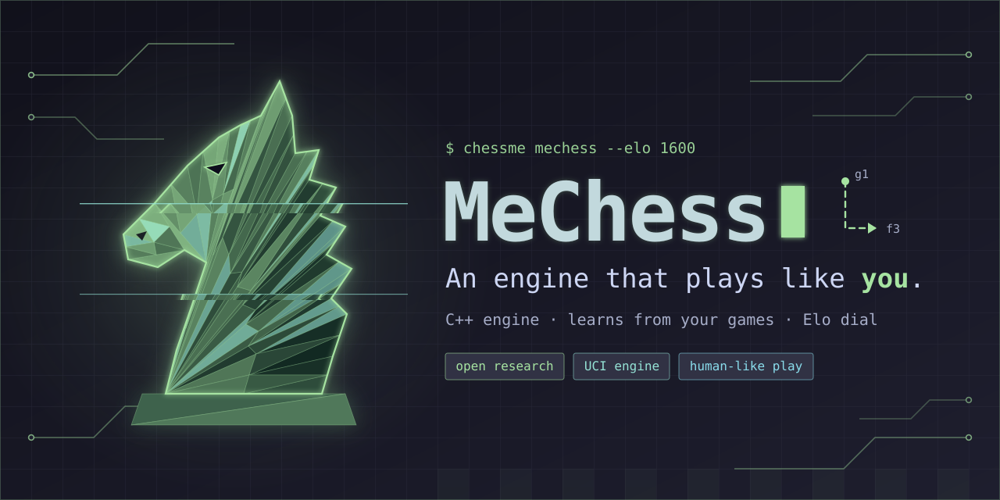
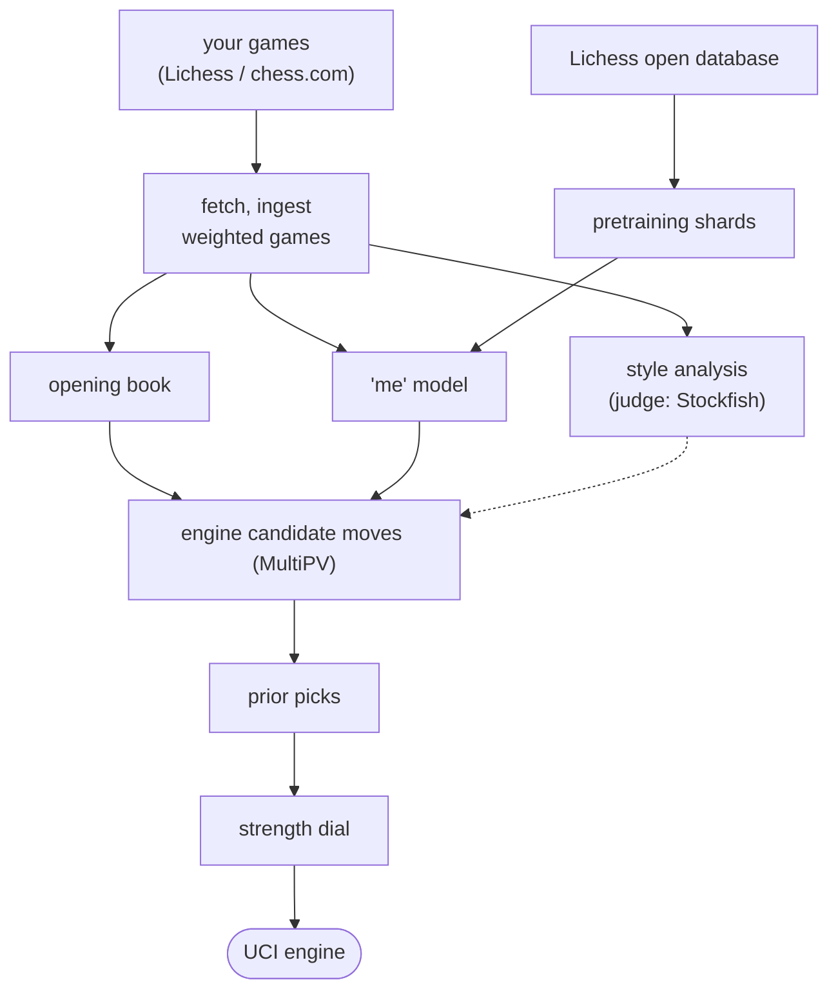

# MeChess

<p align="center"></p>

**A chess engine trained to play like *you*, not to play the strongest possible chess.**

Most engines (Stockfish, Leela) search for the objectively best move. MeChess instead learns the
moves *a specific person* tends to play from their own game history, and uses a real search engine
underneath to keep that playable. Point it at your Lichess or chess.com account and it studies
your openings, your habits, and your move preferences, imperfections included.

[Quick start](#quick-start) · [How it's built](docs/architecture.md) · [Run it as a Lichess bot](docs/lichess-bot.md) · [Analyse your own games](docs/game-analysis.md)

## What makes it different

- **Style over raw strength**: reranks candidate moves to match what *you'd* actually play, not
  whichever line scores highest.
- **Learns from your own games**: trained on your Lichess/chess.com history, not a generic dataset.
- **Real search, not just prediction**: a C++ alpha-beta engine generates the candidates; a small
  trained model picks among them.
- **Built-in game analysis**: classifies every move (Best, Good, Mistake, Blunder, ...) like a
  post-game review, judged by Stockfish.
- **Config-driven, not personal**: no account is hard-coded anywhere; point it at your own games
  and it's your engine, not ours.

Anyone can run this on their own account. Your account names live only in a local, git-ignored
config file, never in the code.

If you're a **chess enthusiast**: think of it as "what if a bot played in *my* style, at *my*
level". You can run it as a Lichess bot, get an accuracy report on your games, or look up any
opening position across rating bands.

If you're an **ML researcher**: it's a personalisation problem on top of policy learning, using a
small residual conv-net policy over a factorised move head (from-square/to-square), pretrained on
population data and fine-tuned per player, combined with classical alpha-beta search via a
candidate-and-rerank controller. See [architecture.md](docs/architecture.md) for the exact design
and [training-resources.md](docs/training-resources.md) for the data.

## What's in the box

| Part | What it does |
|---|---|
| **Engine** (C++17, `engine/`) | A standard alpha-beta chess engine: bitboards, transposition table, quiescence search, time management, UCI protocol. Move generation is checked against published perft test suites. |
| **Data pipeline** (`chessme/ingest`) | Downloads your games from Lichess/chess.com, cleans them up, weights them (recent games and slower time controls count more). |
| **Opening book** (`chessme/book`) | A map of the positions you actually play, built from your games, with how often you go each way. |
| **"Me" model** (`chessme/model`) | A small neural network that predicts the move *you'd* play in a position, at a given rating. Compared against the published Maia-2 / Maia-3 human-move-prediction models. |
| **Controller** (`chessme/mechess`) | The UCI engine you actually play against: opening book first, then the chess engine's candidate moves, then the "me" model picks among them. Has a strength dial. |
| **Style analysis** (`chessme/style`) | Measures *how* you choose between equally good moves (solid vs. sharp, positional vs. tactical), compared against a population of other players. |
| **Game analysis** (`chessme/analysis`) | `chessme analyse`: classes every move in your games (Book, Brilliant, Best, ... Blunder), accuracy by game phase, your worst mistakes. |
| **Opening explorer** (`chessme/book`) | A Lichess-style "what does everyone play here" lookup, built from a public database, broken down by rating band. |
| **Chess-book reader** (`chessme/books`) | Reads 100+ public-domain chess books and annotated games, and trains a small language model on how they describe moves. |
| **Lichess bot** | Runs MeChess as an actual bot account on Lichess. |

## Quick start

You need Python 3.10+ and a C++17 compiler (`clang++` or `g++`). Stockfish is optional but
recommended: it's what judges "good moves" for analysis and style measurement.

```bash
git clone https://github.com/<you>/MeChess.git && cd MeChess
python3 -m venv .venv && .venv/bin/pip install -r requirements.txt -r requirements-dev.txt
make -C engine        # builds engine/build/chessme-engine
make test              # a few seconds: C++ + Python unit tests, a quick perft check
```

Set up your own profile. This is where your account names go, and it never gets committed:

```bash
cp configs/profiles/example.yaml configs/profiles/me.yaml   # edit it: your accounts, rating floors
export CHESSME_PROFILE=me

.venv/bin/python -m chessme fetch      # download your games
.venv/bin/python -m chessme ingest     # clean and normalise them
.venv/bin/python -m chessme audit      # see what you got (counts, ratings, colour split)
.venv/bin/python -m chessme book       # build your opening book
```

Play against it, either the raw engine or the full "plays like me" controller:

```bash
engine/build/chessme-engine                                     # plain engine, speaks UCI
.venv/bin/python -m chessme mechess --elo 1600 --prior uniform   # the full controller
```

Get a report on your own games, or look up a position in the opening explorer:

```bash
.venv/bin/python -m chessme analyse my_games.pgn --player MyName
.venv/bin/python -m chessme explorer-query data/explorer/explorer.db --rating 1500 --fen "<FEN>"
```

More detail: [getting started](docs/getting-started.md) (every step above, explained) and
[every command](docs/cli.md).

## How it fits together



More detail in [docs/architecture.md](docs/architecture.md).

## Documentation

- [Getting started](docs/getting-started.md): install, build, first run, environment variables
- [Command reference](docs/cli.md): every `chessme` command and engine UCI option
- [Architecture](docs/architecture.md): how the code is laid out and how data flows through it
- [Using Stockfish](docs/stockfish.md): why and how it's used as a judge
- [Lichess bot](docs/lichess-bot.md): running MeChess as a bot account
- [Strength and the rating dial](docs/calibration.md): how strength is measured and calibrated
- [Style analysis](docs/style-analysis.md): the method, data, and its limits
- [Game analysis](docs/game-analysis.md): move classes, accuracy, the `analyse` report
- [Opening explorer](docs/opening-explorer.md): what's collected and how to query it
- [Books, annotated games, and the language model](docs/language-model.md)
- [Running on Kaggle](docs/kaggle.md): the notebooks, quotas, checkpoints
- [Data sources and privacy](docs/data-sources.md), [training resources](docs/training-resources.md),
  [third-party software](docs/third-party.md), [testing](docs/testing.md), [running long jobs](docs/operations.md)

## Privacy

Your account names live only in your own profile file, which is git-ignored and never leaves your
machine. Tokens are read from the environment (`LICHESS_TOKEN`), never from a file. Only public
games are used. See [data sources and privacy](docs/data-sources.md).

## Contributing

Issues and pull requests are welcome. See [CONTRIBUTING.md](CONTRIBUTING.md) for the testing
policy and how to send a change.

## License

[MIT](LICENSE): free to use, modify, and distribute, including commercially. Stockfish (GPL),
Maia-2 / Maia-3 (AGPL / research releases), and any game archives you download have their own
terms; MeChess uses them only as external programs or data you fetch yourself, and never bundles
or copies them. See [third-party software](docs/third-party.md).
