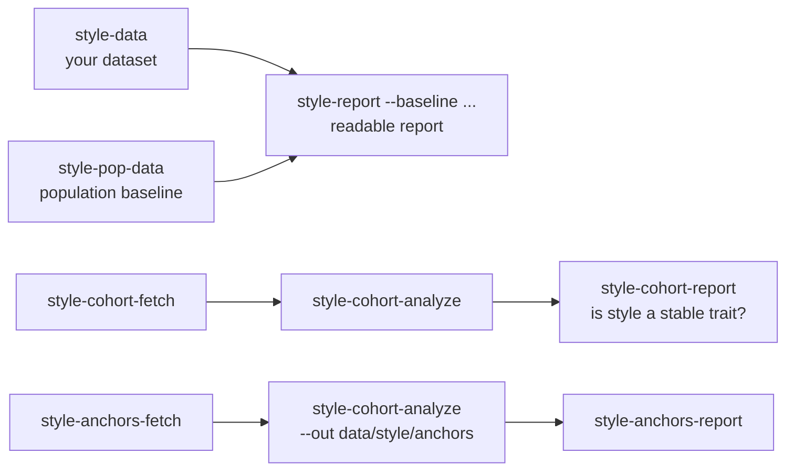

# Style analysis

**Question:** among moves that are about equally good, which one does this player tend to choose?
Style is measured *at the choice level*, so it is not confounded by the opening, the rating or the opponent.

## The pieces

1. **Judge** ([Stockfish](stockfish.md)): for each decision, the engine's best lines (MultiPV 8, 20,000 nodes) give the
   *candidate set*: moves within a window (default 60 cp) of the best. Positions with a single good move carry no
   style information and are skipped. If the played move is not a candidate, the player made a mistake; that position is
   counted but not used for the style fit.
2. **Move features** (`chessme/style/features.py`): 28 numbers per move, from chess theory and computed from the board only:
   forcing (capture, check, promotion, castling side); material (sacrifice, exchange sacrifice, trade, queen trade, via a
   static-exchange evaluator); king (pressure on the enemy king zone, pawn storm, weakening your own king); pawn
   structure (pawn break, doubled / isolated / passed pawn changes for both sides, bishop pair); files (rook on open /
   semi-open file, seventh rank); activity (mobility change, central squares, pushes, retreats, king moves).
3. **Choice model** (`chessme/style/model.py`): a conditional logit. The probability of choosing move *m* among the
   candidates is a softmax of `w . z(features) - c * loss(m)`, where `z` standardises each feature and `c` measures how much
   the player cares about strength. The fitted weights `w` are the player's preferences. On held-out games we report
   accuracy against picking at random and against a strength-only model.
4. **Population baseline** (`style-pop-data`): the same data from thousands of other players (Lichess dump, streamed,
   balanced per 100-point rating bin over a wide range). The player's weights are compared with the population's
   expected weights at the player's rating; a z-score says how many standard errors apart they are. The
   readable report (`style-report --baseline ... --out report.md`) puts this in words.
5. **Cohort** (`style-cohort-*`): hundreds of individual players with about 50 games each. Two tests decide whether style
   is a measurable trait at all:
   - *split-half reliability*: fit each player on alternating halves of their games; the covariance of the two halves
     across players is the true between-player variance of each preference and the correlation is its reliability;
   - *trait test*: does a player's fitted style predict their other half better than the population's style does?
   A *fair* version shrinks each preference towards the population by its own reliability (estimated on other players), the
   standard estimator when individual fits are noisy. The cohort also gives the honest yardstick for "unusual": z-scores against
   the between-player spread, not just sampling noise.
6. **Anchors** (`style-anchors-*`, `configs/anchors.yaml`): famous players (attackers, defenders, positional players,
   universal players) sampled from their peak years, about 100 classical games each. They give the report its
   vocabulary. Two checks: can the features tell the anchors apart (a confusion matrix on held-out chunks), and whose
   preferences predict your choices best. Anchors are landmarks; the wide cohort, not the anchors, is the
   yardstick for "how unusual are you".
7. **Summary** (`style-summary`): puts one player against all of the above in one report. Section 1 uses the cohort as the yardstick
   (only preferences with reliability of at least 0.1 are reported; the player's distance is in between-player SD units), section 2 gives
   each hypothesis axis its own reliability across players, section 4 tests the anchors grouped by style pole (a 5-way question
   that needs far less data than 35 individuals).
8. **Habit rates** (`style-rates`): plain per-player rates of each feature over all decisions, their split-half reliability across the
   cohort (raw and net of rating), whether they separate the anchors, and a player's profile in cohort SD units.
9. **Judge comparison** (`style-judge-compare`): how much the choice of judge changes candidate sets and results.

## Findings so far

From a cohort of 1,000 Lichess players (rated 1500 to 2600, blitz and rapid, 50 games each, about 128 usable decisions per half,
Stockfish as the judge) and 35 famous anchor players (100 classical peak-year games each). These are aggregates; the numbers
depend on the feature set and the amount of data and will change with either.

- **Most of "style" is shared.** Choosing among near-equal moves is predicted about 5 points better by the 28 features
  (which every player shares to a similar degree) than by move strength alone.
- **The personal part is small.** Trusting a player's own fitted preferences fully predicts their other games *worse* than the
  population's preferences (about 128 decisions cannot support 28 personal weights). Shrinking each preference towards the
  population by its own reliability does give a small but real gain (about +0.002 log-loss per decision, roughly 5 standard
  errors over 500 players). Style differences between players exist, but these features barely see them.
- **What is reliably personal:** how much a player cares about move strength (reliability about 0.4) and castling timing
  (about 0.3); then mobility, pawn pushes and pawn breaks (0.14 to 0.19). Most other preferences have reliability under 0.1.
- **Anchors cannot be told apart.** A 35-way classification of held-out chunks from the famous anchor players is at chance
  (3%), so claims such as "closest to player X" are not supported by these features at this data volume.
- **Anchors and the game-level features / embedding.** `style-anchors-games` and `style-anchors-games-report` ask the same identification question of the anchors with the newer features (openings and game shape; the classical over-the-board files have no clocks) and with the embedding trained on the online cohort, and check whether the embedding sees era and format instead of style. Result (35 anchors, 100 peak-year games each, alternating games as the two halves): the raw aggregated features identify the right anchor **44%** of the time (top-5 84%; chance 2.9%) and the embedding 40% (top-5 76%), in contrast to the move-choice features, which were at chance. The two halves interleave the same years and events, so part of this is repertoire and era shared between the halves, not style. The embedding's nearest anchor is a contemporary (within 15 years) for 63% of the anchors against 31% of all pairs, and anchors are almost identical to each other in the embedding (cosine 0.99) while the nearest online player is at 0.74: it sees era and format strongly. Reading: openings and game shape carry a stable per-player signature even for players from other eras, but the classical-versus-online difference dominates, so anchors are still not usable as style landmarks for an online player.
- **Consequence.** Do not describe a player as "aggressive" or "positional" from these features alone. The parts of "plays like
  me" that are clearly personal are the opening repertoire, the move-prediction model fine-tuned on the player's games, time use, and
  how much the player cares about strength.

- **Plain habit rates are far more reliable than choice-level preferences.** Counting how often a player's move has each feature
  (no engine, no filtering by move quality) gives split-half reliabilities across the 1,000 cohort players of 0.3 to 0.47
  (0.45 to 0.64 with all the data) for castling side, king moves, checks, king-zone pressure, pawn storms, captures, retreats and pawn
  pushes, and they barely change after removing the linear effect of rating. Players do differ stably; habit rates simply mix taste with
  the positions a player reaches (openings, time control), whereas choice-level preferences are clean but thin.
- **Even habit rates do not recover style poles.** Anchors assigned by habit rates: 6% at the anchor level (chance 2.9%) and 25% at the pole
  level (majority baseline 26%). The anchors span eras and formats (classical over-the-board against an online blitz / rapid cohort), and
  the pole labels are hypotheses, so this is not evidence that styles do not exist, only that these features do not show them.

Ideas that could raise the signal: many more decisions per player, features that see plans and structure over several moves,
clock-based features (time use is likely a strong personal trait), and game-level statistics (opening choice, castling ply,
length of games) in addition to move-level choices.

## Game-level features and the player embedding (second design)

The move-choice features above turned out to be barely reliable, so a second set describes *games* instead of single decisions (`chessme/style/`
`gamefeatures.py`, `gamestats.py`, `embed.py`, `quality.py`): 26 opening features (first moves, early development, castling), 14 game-shape
features (length, captures, endgame, how it ended), 14 clock features (think times, instant moves, time trouble) and 5 repertoire statistics.
They are computed from the game text alone, for the cohort's games refetched with clocks and openings (`style-games-fetch`).

Measured on 999 players with 50 games each (each player's games split into alternating halves, so a feature is reliable when a player's two
halves agree):

- **Reliable**: 56 of 59 features pass the pre-fixed keep rule (enough coverage, full-data reliability at least 0.5, and either weakly related to
  rating or still reliable after removing it).
- **Identification** (is a player's half A closest to their own half B among 999 players; chance 0.1%): all features 64% top-1 and 85% top-5; the
  kept features 68% / 87%; openings alone 38%; clock features alone 21% (the time control alone identifies 10%, which is a confound: players stay
  on one time control in 94% of their games); game shape alone 2-3%.
- **A learned embedding** (a set encoder trained contrastively on a player's games, evaluated on 249 held-out players): 85% top-1 and 98% top-5,
  against 78% / 94% for the raw features; among players within 100 rating points of each other 93% against 88% for the raw features (chance 3%);
  a linear map from the embedding to rating explains about half of the variance (R squared 0.51), so much of what it encodes is still strength.
- An artefact was found and removed: the clock reading after the first move depends on the increment, not on the player.
- **Move-quality features** (accuracy by phase, class rates, opportunism, conversion; [game-analysis.md](game-analysis.md)) are computed for a
  sample of 400 players.

What this shows: players are reliably *distinguishable* by what they play and how they use the clock. It does not show that any axis means
"aggressive" or "positional"; naming axes still needs validation against players whose style is known.

## Research directions (what the literature suggests)

A review of published work on identifying and modelling individual chess players points to the following. Sources
are given so they can be checked; claims marked (abstract) were not verified beyond the abstract.

- **Identification is feasible with learned features and many games.** Behavioral stylometry (McIlroy-Young et al., NeurIPS 2021,
  [arXiv 2208.01366](https://arxiv.org/abs/2208.01366)) identifies players from thousands of candidates with 98% accuracy given 100 games,
  using a Maia-style move encoder, a transformer over a game and a contrastive loss. **Opening choice is the most revealing part.**
- **Personalisation needs few games with the right design.** Maia4All ([arXiv 2507.21488](https://arxiv.org/abs/2507.21488)) models an individual
  from 20 games instead of 5,000 (abstract).
- **Style on top of a strong policy is a small residual.** MATILDA ([arXiv 2606.25176](https://arxiv.org/abs/2606.25176)) finds that player-style
  embeddings add about 1.8% NLL beyond a rating-conditioned policy plus engine search.
- **Time use is a behaviour worth modelling.** ChessMimic ([arXiv 2606.04473](https://arxiv.org/abs/2606.04473), abstract) predicts thinking time;
  a small unreviewed project reports that clock habits alone can identify players (unverified).
- **Hand-built textbook features help in the opening.** [arXiv 2504.05425](https://arxiv.org/abs/2504.05425): piece-type move counts, early queen moves,
  castling, central control, development speed.
- **Complexity and sharpness have published engine-based measures:** variation entropy ([arXiv 2505.03251](https://arxiv.org/abs/2505.03251), abstract) and
  win / draw / loss based sharpness.
- **Industry tools report performance dimensions, not styles:** Aimchess uses openings, tactics, endings, advantage capitalization, resourcefulness
  and time management, compared with players of the same rating. Advantage capitalization and resourcefulness are the style-like ones.

Named "types" are given only where reliable, rating-independent dimensions exist; see the game-level features and embedding results above.

## Order of a full run

## Things to know

- **Judge matters.** With a weak judge, differences between a player and the population were exaggerated. Use Stockfish.
- **Multiple comparisons.** With 28 features some z-scores above 2 are expected by chance. Read the report's list of
  differences with that in mind.
- **Approximate peak years.** The anchor windows in `configs/anchors.yaml` are approximate and should be checked
  against rating histories.
- **Name spellings.** Game archives spell the same player differently (`Jobava,Ba`, `Kortschnoj, Viktor`). The anchor fetch logs
  the names it finds and warns about unmatched ones; `style-anchors-verify` checks every anchor against the archive page.
- **Limits.** The feature set cannot see plans, prophylaxis or move-order ideas. Online blitz and over-the-board classical
  games differ. Style is only measured among near-equal moves; mistakes are a different topic.
